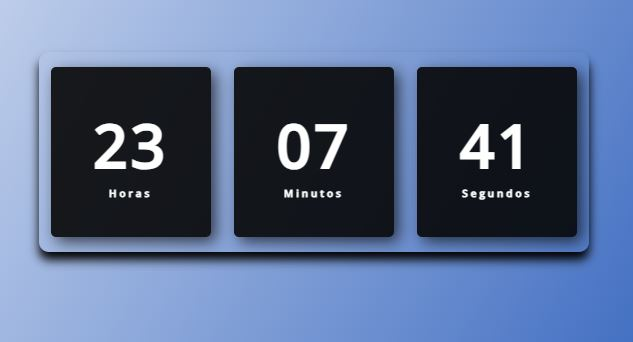

<h1 align="center">
 
   <strong align="center">Relógio Digital</strong>
</h1>

  <a href="#wrench-built-with">Built With</a>&nbsp;&nbsp;&nbsp;|&nbsp;&nbsp;&nbsp;
  <a href="#pencil-author">Author</a>

 

  

## :wrench: Built With

- [HTML]
- [CSS]
- [JAVASCRIPT]

## :pencil: Author

  <a href="https://github.com/JoaoPauloPereirax"> <b>João Paulo Pereira</b></a> 

